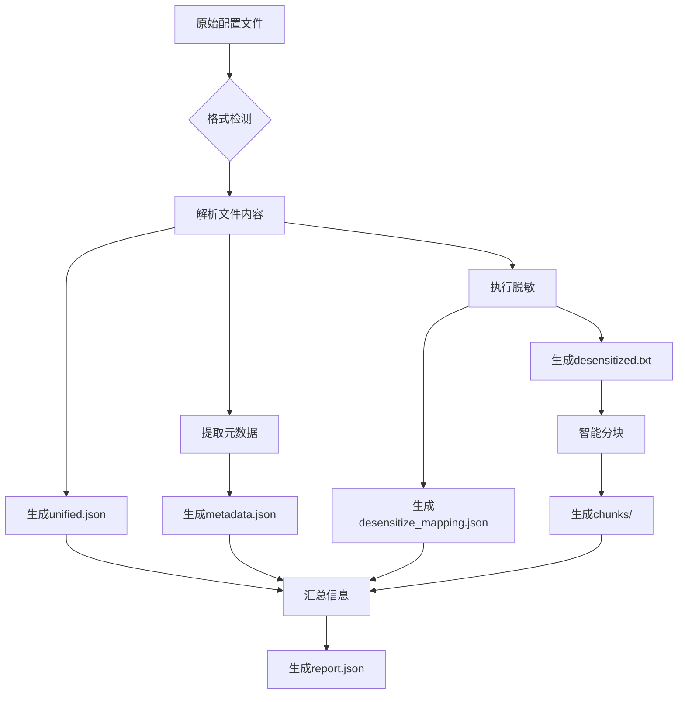

# 配置预处理输出文件详细解析

## 目录结构概览

```
output/20251205_020503/tmp9mdv5gb8/
├── tmp9mdv5gb8_unified.json           # 统一格式文件
├── tmp9mdv5gb8_metadata.json          # 元数据文件
├── tmp9mdv5gb8_desensitized.txt       # 脱敏后的配置文件
├── tmp9mdv5gb8_desensitize_mapping.json # 脱敏映射表
├── tmp9mdv5gb8_report.json            # 处理报告
└── chunks/                             # 分块目录
    ├── chunks_index.yaml               # 分块索引
    ├── chunk_0000.txt                  # 分块内容
    └── chunk_0000_meta.yaml            # 分块元数据
```

---

## 文件处理流程

程序按照以下5个步骤依次处理配置文件（代码位置：`src/preprocessor.py:169-253`）：

```
原始文件
  ↓
Step 1: 格式检测和转换 → unified.json
  ↓
Step 2: 元数据提取 → metadata.json
  ↓
Step 3: 脱敏处理 → desensitized.txt + desensitize_mapping.json
  ↓
Step 4: 智能分块 → chunks/
  ↓
Step 5: 生成处理报告 → report.json
```

---

## 1. unified.json - 统一格式文件

### 1.1 生成依据
**代码位置**: `src/preprocessor.py:169-179`
```python
if convert_format:
    logger.info("Step 1: 格式转换...")
    unified = self.converter.process_file(str(file_path))
    unified_file = file_output_dir / f"{file_path.stem}_unified.json"
    self.converter.save_unified(unified, str(unified_file))
```

### 1.2 处理原理
**格式转换器**: `src/format_converter.py`

#### 1.2.1 格式检测（`detect_format`方法）
```python
# 检测逻辑优先级：
1. 文件扩展名判断
   - .xml → XML格式
   - .json → JSON格式
   - .yaml/.yml → YAML格式
   - .txt → TEXT格式

2. 文件内容判断（读取前1KB）
   - 以'<'开头 → XML
   - 以'{'或'['开头 → JSON
   - 包含':'和'-' → YAML
   - 其他 → TEXT
```

#### 1.2.2 格式转换逻辑

本例中，输入文件是 **YAML格式**，转换过程：

1. **YAML解析** (`process_file`方法)
```python
# 使用yaml.safe_load解析YAML内容
with open(file_path, 'r') as f:
    parsed = yaml.safe_load(f)
```

2. **层次结构分析** (`_build_hierarchy`方法)
```python
# 递归分析配置结构
- 识别容器节点（dict/list）
- 识别叶子节点（值）
- 记录值类型（str/int/bool等）
```

3. **行号映射** (`_create_line_mapping`方法)
```python
# 建立配置项到原文件行号的映射
line_mapping: {
    "default.key": 2,  # 第2行
    "global.timezone": 1  # 第1行
}
```

### 1.3 输出结构
```json
{
  "metadata": {
    "original_format": "yaml",  // 原始格式
    "type": "yaml",              // 文件类型
    "sections": ["global", "eric-pc-mm", ...]  // 主要章节
  },
  "config": {
    // 完整的配置内容（保持原结构）
  },
  "hierarchy": {
    // 配置层次结构
    "global": {
      "type": "container",
      "children": {...}
    }
  },
  "line_mapping": {
    // 配置项到行号的映射
  }
}
```

---

## 2. metadata.json - 元数据文件

### 2.1 生成依据
**代码位置**: `src/preprocessor.py:183-193`
```python
if extract_metadata:
    metadata = self.metadata_extractor.extract(original_text)
    metadata_file = file_output_dir / f"{file_path.stem}_metadata.json"
    with open(metadata_file, 'w', encoding='utf-8') as f:
        json.dump(metadata, f, ensure_ascii=False, indent=2)
```

### 2.2 处理原理
**元数据提取器**: `src/metadata_extractor.py`

#### 2.2.1 5GC网元识别
```python
# 使用正则表达式识别5G核心网网元
nf_patterns = {
    'AMF': r'\b(AMF|amf)[_\-]?\w*',
    'SMF': r'\b(SMF|smf)[_\-]?\w*',
    'UPF': r'\b(UPF|upf)[_\-]?\w*',
    'NRF': r'\b(NRF|nrf)[_\-]?\w*',
    'UDM': r'\b(UDM|udm)[_\-]?\w*',
    'PCF': r'\b(PCF|pcf)[_\-]?\w*',
    'CHF': r'\b(CHF|chf)[_\-]?\w*',
    ...
}

# 统计每种网元出现次数
network_functions = {
    "SMF": {
        "count": 8,          # 出现8次
        "instances": ["smf"]  # 实例名称
    }
}
```

#### 2.2.2 功能特性识别
```python
# 识别5G特性
feature_patterns = {
    'authentication': r'\b(auth|AUSF|SUPI|SUCI|AKA)',
    'security': r'\b(security|encryption|integrity)',
    'policy': r'\b(policy|PCF|PCC|rule)',
    'session': r'\b(session|PDU|PDN|bearer)',
    'handover': r'\b(handover|mobility|HO)',
    ...
}

# 结果：
features = ["handover", "authentication", "security", "policy", "session"]
```

#### 2.2.3 网络信息提取
```python
# 1. IP地址提取
ip_pattern = r'\b(?:\d{1,3}\.){3}\d{1,3}\b'
# 提取所有IP，统计网段分布
ip_addresses = {
    "total": 11,
    "samples": ["10.253.12.172", "10.253.11.108", ...],
    "common_segments": {
        "10.253": 12,  # 10.253网段出现12次
        "10.131": 8    # 10.131网段出现8次
    }
}

# 2. 端口提取
port_pattern = r'port:\s*(\d+)|:(\d+)'
ports = ["22", "9080", "514"]

# 3. 域名提取
domain_pattern = r'\b(?:[a-z0-9](?:[a-z0-9-]{0,61}[a-z0-9])?\.)+[a-z]{2,}\b'
domains = ["nels.ericsson.com", "kubernetes.io", ...]
```

#### 2.2.4 统计信息计算
```python
# 文件统计
statistics = {
    "total_lines": 1040,        # 总行数
    "non_empty_lines": 947,     # 非空行数
    "comment_lines": 177,       # 注释行数
    "size_bytes": 27017,        # 文件大小（字节）
    "size_mb": 0.03,            # 文件大小（MB）
    "config_items": 751,        # 配置项数量
    "character_stats": {
        "alphabetic": 15654,    # 字母字符数
        "numeric": 789,         # 数字字符数
        "whitespace": 8160,     # 空白字符数
        "special": 2414         # 特殊字符数
    }
}
```

#### 2.2.5 复杂度评估
```python
# 根据配置项数量和层级深度评估
def _calculate_complexity(self, metadata: Dict) -> Dict:
    score = 0
    factors = []

    # 配置项数量评分
    config_items = metadata['statistics']['config_items']
    if config_items > 1000:
        score += 30
        factors.append("high_config_items")
    elif config_items > 500:
        score += 10
        factors.append("moderate_config_items")

    # 复杂度等级
    if score >= 50:
        level = "high"
    elif score >= 20:
        level = "medium"
    else:
        level = "low"

    return {"level": level, "score": score, "factors": factors}
```

---

## 3. desensitized.txt - 脱敏后的配置文件

### 3.1 生成依据
**代码位置**: `src/preprocessor.py:195-217`
```python
if desensitize:
    # 执行脱敏（基于原始文本，保持格式）
    desensitized_content, desensitize_mapping = \
        self.desensitizer.desensitize_text(original_text)

    # 保存脱敏后的内容
    desensitized_file = file_output_dir / f"{file_path.stem}_desensitized.txt"
    with open(desensitized_file, 'w', encoding='utf-8') as f:
        f.write(desensitized_content)
```

### 3.2 处理原理
**脱敏器**: `src/desensitizer.py`

#### 3.2.1 脱敏策略配置
配置文件：`config.yaml`
```yaml
desensitization:
  enabled: true
  patterns:
    ip_addresses:
      pattern: '\b(?:\d{1,3}\.){3}\d{1,3}\b'
      replacement: 'masked_by_network'  # 按网段脱敏

    passwords:
      pattern: '(password|passwd|pwd|secret|key|Secret|Key)\s*[:=]\s*["\']?([^"\'\s]+)["\']?'
      replacement: '********'

    phone_numbers:
      pattern: '\b1[3-9]\d{9}\b'
      replacement: '1**********'
```

#### 3.2.2 IP地址脱敏逻辑
```python
def _desensitize_ip_addresses(self, text: str) -> Tuple[str, Dict]:
    """
    IP地址脱敏策略：
    1. 识别所有IP地址
    2. 按网段分组（保留前两段）
    3. 替换后两段为xxx.xxx
    """
    ip_pattern = re.compile(r'\b(\d{1,3})\.(\d{1,3})\.(\d{1,3})\.(\d{1,3})\b')
    mapping = {}

    def replace_ip(match):
        original = match.group(0)
        # 保留前两段，隐藏后两段
        masked = f"{match.group(1)}.{match.group(2)}.xxx.xxx"
        mapping[original] = masked
        return masked

    result = ip_pattern.sub(replace_ip, text)
    return result, mapping

# 示例：
# 原始：10.253.25.132
# 脱敏：10.253.xxx.xxx
```

#### 3.2.3 密码脱敏逻辑
```python
def _desensitize_passwords(self, text: str) -> Tuple[str, Dict]:
    """
    密码脱敏策略：
    1. 识别password/passwd/secret/key等关键字
    2. 提取其后的值
    3. 完全替换为********
    """
    # 匹配多种密码格式
    patterns = [
        r'(password|passwd|pwd)\s*[:=]\s*["\']?([^"\'\s]+)["\']?',
        r'(secret|Secret|KEY|Key)\s*[:=]\s*([^\s]+)',
    ]

    mapping = {}
    result = text

    for pattern in patterns:
        regex = re.compile(pattern, re.IGNORECASE)

        def replace_pwd(match):
            original = match.group(0)
            key = match.group(1)
            # 完全隐藏密码值
            masked = f"{key}=********"
            mapping[original] = masked
            return masked

        result = regex.sub(replace_pwd, result)

    return result, mapping

# 示例：
# 原始：adminpasswd: password
# 脱敏：adminpasswd=********
```

#### 3.2.4 电话号码脱敏逻辑
```python
def _desensitize_phone_numbers(self, text: str) -> Tuple[str, Dict]:
    """
    电话号码脱敏策略：
    1. 识别中国手机号（1开头11位）
    2. 保留前3位和后4位
    3. 中间4位替换为****
    """
    phone_pattern = re.compile(r'\b(1[3-9]\d)(\d{4})(\d{4})\b')
    mapping = {}

    def replace_phone(match):
        original = match.group(0)
        # 保留前3位和后4位
        masked = f"{match.group(1)}****{match.group(3)}"
        mapping[original] = masked
        return masked

    result = phone_pattern.sub(replace_phone, text)
    return result, mapping

# 示例：
# 原始：13812345678
# 脱敏：138****5678
```

#### 3.2.5 脱敏统计
```python
# 统计每种类型的脱敏次数
self.statistics = {
    'total_replacements': 17,  # 总替换次数
    'by_type': {
        'ip_addresses': 11,     # IP地址11处
        'passwords': 6          # 密码6处
    }
}
```

---

## 4. desensitize_mapping.json - 脱敏映射表

### 4.1 生成依据
**代码位置**: `src/preprocessor.py:209-213`
```python
# 保存脱敏映射
mapping_file = file_output_dir / f"{file_path.stem}_desensitize_mapping.json"
with open(mapping_file, 'w', encoding='utf-8') as f:
    json.dump(desensitize_mapping, f, ensure_ascii=False, indent=2)
```

### 4.2 内容结构
```json
{
  "ip_addresses": {
    "10.253.25.132": "10.253.xxx.xxx",  // 原值 → 脱敏值
    "10.131.40.132": "10.131.xxx.xxx",
    ...
  },
  "phone_numbers": {},  // 本例中没有电话号码
  "imsi": {},           // 本例中没有IMSI
  "imei": {},           // 本例中没有IMEI
  "passwords": {
    "password: \"password\"": "password=********",
    "passwd: \"password\"": "passwd=********",
    "Secret: false": "Secret=********",
    "Secret: eric-pc-controller-data-distributed-coordinator-secret": "Secret=********",
    "secret: eric-pc-controller-ldap-admin-creds": "secret=********",
    "Key: kubernetes.io/hostname": "Key=********"
  },
  "customers": {},      // 本例中没有客户名称
  "urls": {}            // 本例中没有URL
}
```

### 4.3 用途说明
1. **可逆恢复**: 通过映射表可以恢复原始数据（需要权限）
2. **审计追踪**: 记录哪些数据被脱敏了
3. **数据分析**: 了解敏感数据的分布情况

---

## 5. chunks/ - 智能分块目录

### 5.1 生成依据
**代码位置**: `src/preprocessor.py:222-233`
```python
if chunk:
    logger.info("Step 4: 智能分块...")
    chunks = self.chunker.chunk_text(content_for_chunking)

    # 保存分块
    chunks_dir = file_output_dir / "chunks"
    self.chunker.save_chunks(chunks, str(chunks_dir))
```

### 5.2 处理原理
**智能分块器**: `src/chunker.py`

#### 5.2.1 分块策略
```python
class ChunkStrategy(Enum):
    """分块策略"""
    FIXED_SIZE = "fixed_size"    # 固定大小分块
    SMART = "smart"               # 智能分块（推荐）
    SECTION_BASED = "section"     # 基于章节分块
```

#### 5.2.2 智能分块算法
```python
def chunk_text(self, text: str) -> List[Chunk]:
    """
    智能分块逻辑：
    1. 识别配置文件的自然边界（章节、功能模块）
    2. 确保每个块在大小限制内
    3. 添加重叠区域保证上下文连贯性
    """
    strategy = self.config.get('default_strategy', 'smart')

    if strategy == 'smart':
        return self._smart_chunk(text)
    elif strategy == 'section':
        return self._section_based_chunk(text)
    else:
        return self._fixed_size_chunk(text)
```

#### 5.2.3 智能分块实现
```python
def _smart_chunk(self, text: str) -> List[Chunk]:
    """
    智能分块步骤：
    1. 识别配置块（如eric-pc-mm:, eric-pc-sm:等）
    2. 提取每个块的特性标签
    3. 在保持语义完整的前提下分块
    4. 添加重叠行确保上下文
    """
    lines = text.split('\n')
    chunks = []
    current_chunk_lines = []
    current_features = set()

    for i, line in enumerate(lines):
        # 检测特性
        features = self._detect_features(line)
        current_features.update(features)

        current_chunk_lines.append(line)

        # 检查是否需要分块
        if self._should_split(current_chunk_lines, current_features):
            chunk = self._create_chunk(
                chunk_id=len(chunks),
                lines=current_chunk_lines,
                features=list(current_features),
                start_line=i - len(current_chunk_lines) + 1,
                end_line=i
            )
            chunks.append(chunk)

            # 重置，保留重叠行
            overlap = self.config.get('overlap_lines', 5)
            current_chunk_lines = current_chunk_lines[-overlap:]
            current_features = set()

    return chunks
```

#### 5.2.4 特性检测
```python
def _detect_features(self, line: str) -> List[str]:
    """
    检测行中包含的5G特性
    """
    features = []

    # 检测网元
    if re.search(r'\b(SMF|smf)\b', line):
        features.append('SMF')
    if re.search(r'\b(AMF|amf)\b', line):
        features.append('AMF')
    if re.search(r'\b(UPF|upf)\b', line):
        features.append('UPF')

    # 检测功能
    if re.search(r'\b(session|PDU)\b', line, re.I):
        features.append('session')
    if re.search(r'\b(auth|AUSF)\b', line, re.I):
        features.append('authentication')
    if re.search(r'\b(security|encrypt)\b', line, re.I):
        features.append('security')

    return features
```

### 5.3 分块输出文件

#### 5.3.1 chunk_0000.txt
```yaml
# 第一个分块的实际内容
# 包含从第1行到第1040行的配置
global:
  timezone: EET
  interfacePrefixes:
  ...
```

#### 5.3.2 chunk_0000_meta.yaml
```yaml
chunk_id: 0                  # 块编号
start_line: 1                # 起始行号
end_line: 1040               # 结束行号
overlap_start: null          # 重叠开始行（第一块无重叠）
overlap_end: null            # 重叠结束行
features:                    # 该块包含的特性
  - CHF
  - security
  - SMF
  - PCF
  - routing
  - UDM
  - session
  - AMF
  - NRF
  - authentication
metadata:
  line_count: 1040           # 行数
  feature_count: 10          # 特性数量
  strategy: smart            # 分块策略
```

#### 5.3.3 chunks_index.yaml
```yaml
total_chunks: 1              # 总块数
chunks:
  - id: 0                    # 块ID
    lines: 1-1040            # 行范围
    size: 26943              # 字节大小
    features:                # 特性列表
      - CHF
      - security
      - SMF
      - ...
```

### 5.4 分块的用途
1. **大文件处理**: 将大配置文件分成可管理的小块
2. **并行处理**: 可以并行分析不同的块
3. **特性隔离**: 按功能特性组织，便于理解
4. **LLM友好**: 每个块大小适合LLM处理（不超过token限制）

---

## 6. report.json - 处理报告

### 6.1 生成依据
**代码位置**: `src/preprocessor.py:236-253`
```python
logger.info("Step 5: 生成处理报告...")
report = self._generate_report(
    file_path=str(file_path),
    original_format=original_format,
    metadata=metadata,
    processed_files=processed_files,
    statistics={...}
)

report_file = file_output_dir / f"{file_path.stem}_report.json"
with open(report_file, 'w', encoding='utf-8') as f:
    json.dump(report, f, ensure_ascii=False, indent=2)
```

### 6.2 报告内容结构
```json
{
  "timestamp": "2025-12-05T02:05:03.991476",  // 处理时间戳
  "version": "1.0.0",                         // 工具版本
  "file_path": "/tmp/tmp9mdv5gb8.yaml",      // 原始文件路径
  "original_format": "yaml",                  // 原始格式

  "metadata": {
    // 完整的元数据信息（同metadata.json）
  },

  "processed_files": [
    // 所有生成的文件列表
    "/app/output/.../tmp9mdv5gb8_unified.json",
    "/app/output/.../tmp9mdv5gb8_metadata.json",
    "/app/output/.../tmp9mdv5gb8_desensitized.txt",
    "/app/output/.../tmp9mdv5gb8_desensitize_mapping.json",
    "/app/output/.../chunks"
  ],

  "statistics": {
    "file_size_mb": 0.0258,                  // 文件大小
    "chunks_created": 1,                     // 创建的块数
    "desensitization": {
      "total_replacements": 17,              // 总脱敏次数
      "by_type": {
        "ip_addresses": 11,                  // IP地址脱敏次数
        "passwords": 6                       // 密码脱敏次数
      }
    }
  }
}
```

### 6.3 报告用途
1. **处理审计**: 记录完整的处理过程
2. **质量评估**: 评估处理结果的质量
3. **问题追踪**: 发现处理过程中的问题
4. **统计分析**: 分析配置文件的特征

---

## 关键技术点总结

### 1. 格式无关处理
```python
# 统一接口处理多种格式
supported_formats = ['xml', 'json', 'yaml', 'text', 'ini', 'conf']

# 所有格式最终转换为统一的JSON结构
unified_structure = {
    "metadata": {...},
    "config": {...},
    "hierarchy": {...}
}
```

### 2. 智能识别算法
```python
# 使用正则表达式+启发式规则
- IP地址识别：正则表达式 + 网段分析
- 网元识别：关键词匹配 + 上下文分析
- 特性识别：多模式匹配 + 权重计算
- 密码识别：模式匹配 + 值特征分析
```

### 3. 可配置的处理流程
```yaml
# config.yaml
file_processing:
  supported_formats: [...]

desensitization:
  enabled: true
  patterns:
    ip_addresses: {...}
    passwords: {...}

metadata:
  extract_project_info: true
  extract_version: true
  extract_5gc_info: true

chunking:
  enabled: true
  default_strategy: smart
  max_chunk_size: 100000
```

### 4. 保持可追溯性
```python
# 每个处理步骤都保留映射关系
- line_mapping: 配置项 → 原文件行号
- desensitize_mapping: 原始值 → 脱敏值
- chunk_metadata: 分块 → 原文件行范围
```

---

## 工作流程图



---

## 配置优化建议

### 1. 调整脱敏策略
```yaml
# config.yaml
desensitization:
  patterns:
    ip_addresses:
      # 选项1：完全隐藏
      replacement: 'x.x.x.x'
      # 选项2：保留网段（当前）
      replacement: 'masked_by_network'
      # 选项3：不脱敏
      enabled: false
```

### 2. 调整分块大小
```yaml
chunking:
  max_chunk_size: 100000    # 增大块大小
  overlap_lines: 10         # 增加重叠行数
  min_chunk_size: 10000     # 设置最小块大小
```

### 3. 调整元数据提取
```yaml
metadata:
  extract_5gc_info: true    # 提取5GC信息
  extract_network_info: true  # 提取网络信息
  extract_statistics: true   # 提取统计信息
  extract_complexity: true   # 评估复杂度
```

---

## 常见问题

### Q1: unified.json文件过大怎么办？
A: 在`process_file`时设置`convert_format=False`，跳过格式转换步骤。

### Q2: 如何添加自定义脱敏规则？
A: 在`config.yaml`的`desensitization.patterns`中添加新的正则表达式模式。

### Q3: 分块太多/太少怎么调整？
A: 调整`config.yaml`中的`chunking.max_chunk_size`和`min_chunk_size`参数。

### Q4: 如何恢复脱敏数据？
A: 使用`desensitize_mapping.json`中的映射关系进行反向替换。

---

## 总结

本程序通过5个步骤系统化地处理5GC配置文件：

1. **格式转换**: 统一不同格式到标准JSON结构
2. **元数据提取**: 智能识别网元、特性、网络信息
3. **脱敏处理**: 保护敏感信息（IP、密码等）
4. **智能分块**: 按语义边界分割大文件
5. **报告生成**: 汇总处理结果和统计信息

每个输出文件都有明确的用途，相互关联形成完整的处理链条，既保证了数据安全，又保持了可追溯性和可分析性。
